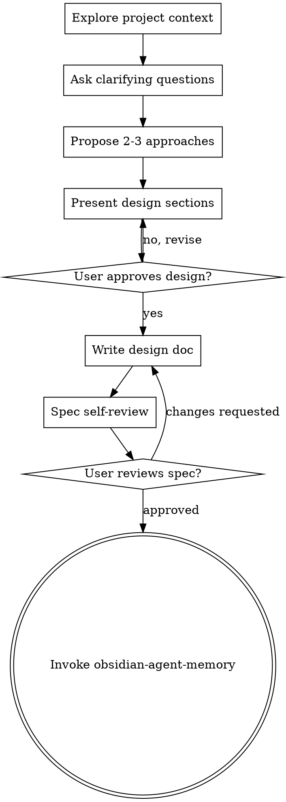

# Brainstorming Ideas Into Designs

Help users turn ideas into fully formed designs and specifications via natural, collaborative dialogue.

Current git remote:
!`git config --get remote.origin.url`

Current directory:
!`pwd`

**Always** begin by exploring current project context, then follow the checklist in strict order.

<HARD-GATE>
Do NOT invoke any implementation skill, write code, scaffold projects, or take any implementation action until you have presented a design **and** the user has explicitly approved it. This gate applies to every project, no matter how simple.
</HARD-GATE>

## Anti-Pattern: "This Is Too Simple To Need A Design"

Every project requires this process. Even a single function or config change benefits from explicit validation. Unexamined assumptions in "simple" work cause the most wasted effort. Keep simple designs short, but always present them and obtain approval.

## Checklist

You MUST complete these tasks in order:

1. **Explore project context** — review files, docs, and recent commits.
2. **Ask clarifying questions** — one at a time, focusing on purpose, constraints, and success criteria.
3. **Propose 2-3 approaches** — include trade-offs and your recommendation.
4. **Present design** — section by section, scaled to complexity; get approval after each section.
5. **Write design doc** — save to the Obsidian vault. Parse injected remote/pwd for {org}/{project} (sensible default if unclear, e.g. local/ from dir). Save to `~/Documents/Obsidian/Personal Vault/code/{org}/{project}/designs/YYYY-MM-DD-<topic>-design.md`. Never use question tool.
6. **Spec self-review** — fix placeholders, contradictions, ambiguity, or scope issues inline.
7. **User reviews written spec** — ask user to review the file before proceeding.
8. **Transition to implementation** — invoke only the `obsidian-agent-memory` skill.

## Process Flow

**Terminal state**: Invoke `obsidian-agent-memory` skill only.

## Core Process Rules

- **Project scoping**: If the request contains multiple independent subsystems, flag it immediately and help the user decompose into separate sub-projects before proceeding.
- **Questioning**: Ask one question at a time. Prefer multiple-choice when effective. Focus on purpose, constraints, and success criteria.
- **Approaches**: Always propose 2–3 options with trade-offs. Lead with your recommended approach and reasoning.
- **Design presentation**: Present in focused sections (architecture, components, data flow, error handling, testing). Scale detail to complexity. Seek approval after each section.
- **Design principles**: Favor small, single-purpose units with clear interfaces. Follow existing codebase patterns. Include targeted improvements to problematic areas that directly affect the current work — never unrelated refactoring.
- **YAGNI**: Ruthlessly eliminate unnecessary features.

## After Design Approval

**Documentation**
Write the approved design to the Obsidian spec file under the canonical vault path (use injected remote/dir to determine org/project or sensible default; no question tool).

**Spec Self-Review** (perform immediately after writing):
1. Remove all placeholders ("TBD", "TODO") and vague language.
2. Ensure internal consistency.
3. Verify scope is appropriate for one implementation plan.
4. Eliminate any remaining ambiguity.

**User Review Gate**
Once self-review passes, say:

> "Design spec written to the Obsidian vault at `<canonical path>/designs/...`. Please review it and let me know if you want any changes before we create the implementation plan."

Only proceed to `obsidian-agent-memory` after explicit user approval.

## Key Principles
- One question at a time
- Always explore alternatives
- Incremental validation at every major step
- Ruthless YAGNI
- Stay focused on the current goal
